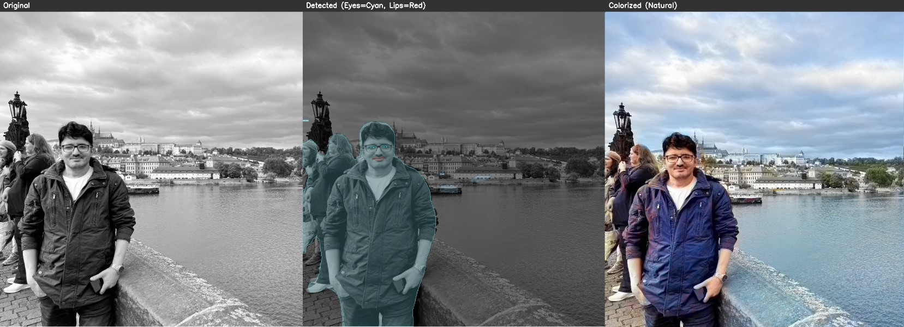

# Enhanced Zhang Colorization with Object Aware Processing

[](https://www.python.org/downloads/)
[](https://opencv.org/)
[](https://pytorch.org/)
[](https://opensource.org/licenses/MIT)

Advanced black and white image or video colorization using **Zhang et al.'s deep learning algorithm** with custom enhancements for object-aware processing, facial feature correction, and color bleeding prevention.

---

## Table of Contents

- [Overview](#-Project Overview)
- [The Problem with Original Zhang Algorithm](#-the-problem-with-original-zhang-algorithm)
- [Our Solutions](#-our-solutions)
- [Visual Results & Comparisons](#-visual-results--comparisons)
- [Technical Architecture](#-technical-architecture)
- [Installation](#️-installation)
- [Usage Guide](#-usage-guide)
- [Project Structure](#-project-structure)
- [Citation](#-citation)
- [License](#-license)
- [Acknowledgments](#-acknowledgments)

---

## Project Overview

This project extends the groundbreaking **Zhang et al. colorization algorithm** with three critical enhancements that solve major real-world problems encountered when colorizing historical photographs, portraits, and complex scenes.

### What is Zhang et al.'s Algorithm?

The [Zhang et al. (2016)](http://richzhang.github.io/colorization/) colorization network is a CNN-based deep learning model trained on over 1.3 million images from ImageNet. It predicts plausible color information (ab channels in Lab color space) from grayscale images (L channel). While revolutionary, it has several limitations in practical applications.

### Why This Project?

After extensive testing with real historical photos, vintage portraits, and complex scenes, we identified **five critical problems** with the original implementation:

1. **Color Bleeding Across Object Boundaries** - Colors leak from one object to another
2. **Inconsistent Colorization** - Same objects receive different colors within the image
3. **Facial Feature Miscoloring** - Eye whites take skin tone, lips appear colorless
4. **Incomplete Coverage** - Some regions remain grayscale or poorly colored
5. **No User Control** - Cannot manually adjust colors of specific objects

This project provides **three specialized Python implementations** that systematically address these issues.

---


## Key Features

### 1. Object Detection Processing (Color Bleeding Prevention)
- **Problem Solved**: Original Zhang algorithm causes color bleeding across object boundaries
- **Solution**: Process each detected object independently using semantic segmentation
- **Technologies**: YOLOv8 / DeepLabV3+ for object detection

### 2. Facial Feature Enhancement
- **Problem Solved**: Eye whites take skin color, lips appear colorless
- **Solution**: Automatic facial landmark detection with natural color correction
- **Technologies**: Dlib 68-point facial landmarks

### 3. Custom Interactive Recolorization
- **Problem Solved**: Limited control over colorization results
- **Solution**: Detect colorizable regions and allow manual color override
- **Technologies**: Chroma threshold analysis for region detection

---

## Results Comparison

### Example 1: My Photo
#### Running by Zhang algorithm
**Issues Fixed:**
- Color bleeding around head contours 
- Uncolored hands and background people 
- Non-uniform jacket coloring 



---

### Example 2: Horse in Landscape
**Issues Fixed:**
- Color leaking from horse neck to background 
- Improved boundary preservation 


---

### Example 3: Vintage Racing Car
**Issues Fixed:**
- People properly colorized 
- Tire rubber correctly colored 
- More uniform coloring throughout 


---

### Example 4: Young Woman Portrait (Facial Enhancement)
**Issues Fixed:**
- Eye sclera corrected to natural white 
- Lips properly colored with natural pink/rose tone 


---

### Example 5: A New Vintage Zealand Woman Portrait
**Issues Fixed:**
- Eye whites no longer match skin tone 
- Natural lip coloration applied 


---

### Example 6: William Holden - Custom Recolorization
**Demonstrates**: Manual color override capability

The tie was automatically colored dark blue/black by Zhang algorithm. Using custom recolorization, it can be changed to:
- Blue variant 
- Red variant 


*Note: Colors are chosen to match grayscale pixel intensity while being more saturated for clarity.*

---

## Installation

### Prerequisites
```bash
Python 3.7+
CUDA-capable GPU (optional, for faster processing)
```

#### ** NOTE: There is a Python code that automatically starts 
#### downloading Zhang model files to the "models" folder in the 
#### root and you can easily use it.


### Step 1: Clone Repository
```bash
git clone https://github.com/YOUR_USERNAME/Zhang-Colorization-Enhanced.git
cd Zhang-Colorization-Enhanced
```

### Step 2: Install Dependencies
```bash
pip install -r requirements.txt
```

### Step 3: Download Zhang Model Files
Download the following files and place them in the `models/` directory:

1. **colorization_deploy_v2.prototxt**
2. **colorization_release_v2.caffemodel**
3. **pts_in_hull.npy**

Download links:
- [Zhang et al. Models](https://github.com/richzhang/colorization/tree/caffe/colorization/models)

### Step 4: Download Facial Landmark Predictor (Optional)
For facial feature enhancement:

```bash
cd models/
wget http://dlib.net/files/shape_predictor_68_face_landmarks.dat.bz2
bunzip2 shape_predictor_68_face_landmarks.dat.bz2
```

---

## Usage

### Method 1: Object-Aware Colorization (Prevent Color Bleeding)

```python
from src.object_detection_colorization import ObjectByObjectColorizer

# Initialize colorizer
colorizer = ObjectByObjectColorizer(
    zhang_model_dir="models",
    use_yolo=False  # Set True if YOLOv8 is installed
)

# Colorize image
colorized_image, debug_info = colorizer.colorize("input_image.jpg")

# Save result
cv2.imwrite("output_colorized.jpg", colorized_image)
```

**Run example:**
```bash
cd src
python object_detection_colorization.py
```

---

### Method 2: Facial Feature Enhancement (Natural Eyes & Lips)

```python
from src.facial_feature_enhancement import FacialFeatureColorizer

# Initialize colorizer
colorizer = FacialFeatureColorizer(
    zhang_model_dir="models",
    landmark_predictor_path="models/shape_predictor_68_face_landmarks.dat"
)

# Process image
original, annotated, colorized, masks, classes = \
    colorizer.process_complete_colorization("portrait.jpg")

# Save results
cv2.imwrite("output_colorized.jpg", colorized)
cv2.imwrite("output_annotated.jpg", annotated)
```

**Run example:**
```bash
cd src
python facial_feature_enhancement.py
```

---

### Method 3: Interactive Custom Recolorization

```python
from src.custom_recolorization import AdaptiveRecolorizer

# Initialize with chroma threshold
colorizer = AdaptiveRecolorizer(
    zhang_model_dir="models",
    use_yolo=False,
    chroma_threshold=5.0  # 3.0=sensitive, 10.0=strict
)

# Automatic colorization
result = colorizer.process_interactive_colorization(
    "input.jpg",
    generate_visualization=True
)

colorized, masks, classes, region_map, visualization = result

# Custom color override
custom_colors = {
    0: (255, 0, 0),    # Object 0 -> Red
    2: (0, 0, 255),    # Object 2 -> Blue
}

custom_result = colorizer.process_interactive_colorization(
    "input.jpg",
    custom_color_map=custom_colors
)
```

**Run interactive mode:**
```bash
cd src
python custom_recolorization.py
```

---

## Project Structure

```
Zhang-Colorization-Enhanced/
│
├── README.md                          # This file
├── requirements.txt                   # Python dependencies
├── LICENSE                            # MIT License
│
├── src/                               # Source code
│   ├── object_detection_colorization.py    # Method 1: Color bleeding prevention
│   ├── facial_feature_enhancement.py       # Method 2: Eye & lip correction
│   └── custom_recolorization.py            # Method 3: Interactive recoloring
│
├── models/                            # Zhang model files (download required)
│   └── README.md                      # Download instructions
│
├── examples/                          # Example images
│   ├── input/                         # Sample B&W images
│   └── output/                        # Colorized results
│
└── docs/                              # Documentation
    ├── comparison_images/             # Before/after comparisons
    └── technical_details.md           # Technical documentation
```

---

## Technical Details

### Architecture Overview

#### 1. Base Zhang Colorization Network
- **Input**: Grayscale image (L channel in Lab color space)
- **Output**: ab color channels
- **Model**: Pre-trained Caffe model with 313 quantized ab values

#### 2. Object Detection Layer
- **Segmentation Options**:
  - YOLOv8-X (instance segmentation, 80 COCO classes)
  - DeepLabV3+ (semantic segmentation, 21 PASCAL VOC classes)
- **Purpose**: Isolate objects for independent colorization

#### 3. Facial Landmark Detection
- **Library**: Dlib 68-point facial landmarks
- **Detected Features**: 
  - Eye contours (points 36-47)
  - Lip contours (points 48-67)
- **Color Correction**:
  - Sclera: Lab(L, 0, 7) - neutral with slight warmth
  - Lips: Lab(L, 45, 25) - natural rose/pink tone

#### 4. Chroma-Based Region Detection
- **Formula**: `chroma = sqrt(a² + b²)`
- **Threshold**: Configurable (default: 5.0)
- **Purpose**: Identify colorizable regions vs achromatic areas

### Color Space Conversion
```
BGR -> Lab Color Space
L: Lightness (0-100)
a: Green-Red axis (-128 to +127)
b: Blue-Yellow axis (-128 to +127)
```

---

## Requirements

```txt
opencv-python>=4.5.0
numpy>=1.19.0
torch>=1.9.0
torchvision>=0.10.0
dlib>=19.22.0 (optional, for facial features)
ultralytics (optional, for YOLOv8)
```

---

## Citation

### Original Zhang et al. Paper
```bibtex
@inproceedings{zhang2016colorful,
  title={Colorful Image Colorization},
  author={Zhang, Richard and Isola, Phillip and Efros, Alexei A},
  booktitle={ECCV},
  year={2016}
}
```

### This Enhanced Implementation
```bibtex
@software{zhang_colorization_enhanced,
  author = {Hadi Sarhangi Fard},
  title = {Zhang Colorization Enhanced: Object-Aware Image Colorization with Facial Feature Correction},
  year = {2025},
  url = {https://github.com/YOUR_USERNAME/Zhang-Colorization-Enhanced}
}
```

---

## Contributing

Contributions are welcome! Please feel free to submit a Pull Request.

1. Fork the repository
2. Create your feature branch (`git checkout -b feature/AmazingFeature`)
3. Commit your changes (`git commit -m 'Add some AmazingFeature'`)
4. Push to the branch (`git push origin feature/AmazingFeature`)
5. Open a Pull Request

---

## License

This project is licensed under the MIT License - see the [LICENSE](LICENSE) file for details.

---

## Acknowledgments

- **Richard Zhang, Phillip Isola, Alexei A. Efros** - Original colorization algorithm
- **Anthropic Claude** - Development assistance
- **OpenCV Community** - Computer vision tools
- **PyTorch Team** - Deep learning framework

---

## Contact

**Author**: Hadi Sarhangi Fard

For questions or feedback, please open an issue in this repository.

---

## Star History

If you find this project useful, please consider giving it a star! ⭐

---

**Last Updated**: January 2026
