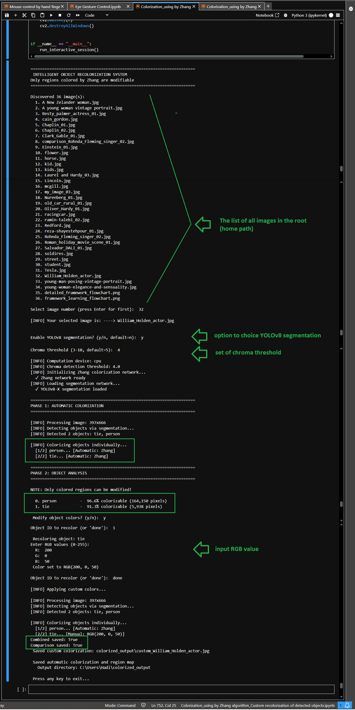

# Zhang Colorization Enhanced

[](https://www.python.org/downloads/)
[](https://opencv.org/)
[](https://pytorch.org/)
[](https://opensource.org/licenses/MIT)

> Advanced black and white image or video colorization using **Zhang et al.'s deep learning algorithm** with custom enhancements for object-aware processing, facial feature correction, and color bleeding prevention.

---

## Table of Contents

- [Overview](#-Overview)
- [The Problem with Original Zhang Algorithm](#-the-problem-with-original-zhang-algorithm)
- [Our Solutions](#-our-solutions)
- [Visual Results & Comparisons](#-visual-results--comparisons)
- [Technical Architecture](#-technical-architecture)
- [Installation](#️-installation)
- [Usage Guide](#-usage-guide)
- [Project Structure](#-project-structure)
- [Citation](#-citation)
- [License](#-license)
- [Acknowledgments](#-acknowledgments)

---

## Overview

This project extends the groundbreaking **Zhang et al. colorization algorithm** with three critical enhancements that solve major real-world problems encountered when colorizing historical photographs, portraits, and complex scenes.

### What is Zhang et al.'s Algorithm?

The [Zhang et al. (2016)](http://richzhang.github.io/colorization/) colorization network is a CNN-based deep learning model trained on over 1.3 million images from ImageNet. It predicts plausible color information (ab channels in Lab color space) from grayscale images (L channel). While revolutionary, it has several limitations in practical applications.

### Why This Project?

After extensive testing with real historical photos, vintage portraits, and complex scenes, we identified **five critical problems** with the original implementation:

1. **Color Bleeding Across Object Boundaries** - Colors leak from one object to another
2. **Inconsistent Colorization** - Same objects receive different colors within the image
3. **Facial Feature Miscoloring** - Eye whites take skin tone, lips appear colorless
4. **Incomplete Coverage** - Some regions remain grayscale or poorly colored
5. **No User Control** - Cannot manually adjust colors of specific objects

This project provides **three specialized Python implementations** that systematically address these issues.

---

## The Problem with Original Zhang Algorithm

### Issue #1: Color Bleeding

**Problem:** Colors from one object "bleed" or "leak" into adjacent objects, especially color bleeding across object boundariess.

**Example:** In horse images, neck colors spread to the background. In my image in Prague, clothing colors contaminate skin regions, and also my face skin color bleeded to the background.

**Root Cause:** The Zhang model processes the entire image holistically without understanding object boundaries.

### Issue #2: Inconsistent Colorization & Uncolored Regions

**Problem:** Objects of the same type receive different colors in different parts of the image. Some regions remain completely grayscale.

**Example:** A person's jacket may be half-colored and half-grayscale, or a car's tires remain black while the body is colored. we can see issues in my image in Prague.jpg and in racing car.jpg colored images by Zhang algorithm.  

**Root Cause:** Limited context window and lack of global semantic understanding.

### Issue #3: Facial Feature Miscoloring

**Problem:** Eye sclera (whites of eyes) take on skin tone instead of white. Lips appear pale or colorless instead of natural pink/rose.

**Example:** In portrait photos, eyes look unnatural with beige/tan whites, and lips blend with surrounding skin.

**Root Cause:** Zhang model treats all facial skin uniformly without anatomical awareness.

### Issue #4: No Custom Control

**Problem:** Cannot manually specify colors for specific objects (e.g., "make this tie red instead of blue").

**Root Cause:** Original implementation is fully automatic with no interactive capabilities.

---

## Our Solutions

### Solution 1: Object-Aware Colorization (Prevent Color Bleeding)

**File:** `object_detection_colorization.py`

**How it works:**
1. Use semantic segmentation (DeepLabV3+ or YOLOv8) to detect individual objects
2. Isolate each object with its mask
3. Colorize each object **independently** using Zhang model
4. Intelligently blend overlapping regions
5. Fill gaps with background colorization

**Key Benefits:**
- Complete elimination of color bleeding across object boundaries
- Each object maintains color integrity
- Proper handling of overlapping objects
- Automatic background completion

**Supported Objects:** 80+ categories including people, animals, vehicles, furniture, nature elements, and more (COCO dataset classes).

---

### Solution 2: Facial Feature Enhancement (Natural Eye & Lip Colors)

**File:** `facial_feature_enhancement.py`

**How it works:**
1. Detect faces using Dlib's frontal face detector
2. Locate 68 facial landmarks (eye contours, lip contours)
3. Extract eye sclera masks (excluding pupils/iris)
4. Extract lip region masks
5. Apply Zhang colorization as base
6. Override eye sclera with natural white (Lab: a≈0, b≈7)
7. Override lip region with natural rose/pink (Lab: a≈45, b≈25)

**Key Benefits:**
- Authentic white eye sclera (prevents skin tone bleeding)
- Natural pink/rose lip coloration
- Maintains all other Zhang colorization features
- Works with portraits from any era

**Technical Details:**
- **Eye Sclera Color:** Neutral white with slight warm yellow undertone
- **Lip Color:** Rose/pink with red dominance and warm undertone
- **Transition:** Gaussian smoothing for natural blending

---

### Solution 3: Interactive Custom Recolorization

**File:** `custom_recolorization.py`

**How it works:**
1. Perform object detection and colorization
2. Analyze chroma intensity to identify "colorizable regions"
3. Generate visual map showing which areas can be recolored
4. Allow user to manually override colors for specific objects
5. Respect colorizable region boundaries (won't color glass, metal, etc.)

**Key Benefits:**
- Full control over object colors
- Intelligent detection of colorizable vs. non-colorizable regions
- Interactive UI for color selection
- Percentage metrics for each object's colorizable area

**Advanced Feature - Colorizable Region Detection:**

Uses **chroma threshold analysis** to identify regions where Zhang applied meaningful color:

```python
chroma = sqrt(a² + b²)  # Color intensity in Lab space
colorizable = chroma > threshold (default: 5.0)
```

This prevents trying to color inherently achromatic objects (glass, chrome, white objects).

---

## Visual Results & Comparisons

### Complete Pipeline Demonstrations

Each of these images shows the **complete transformation process** from original grayscale to final colorization:

#### 1. Portrait of a New Zealand Woman (1940s)


**What this shows:** [Original B&W] → [Object Detection/Segmentation] → [Final Colorization]

**Key improvements:**
- Natural white eye sclera (not skin-toned)
- Proper pink lip coloration
- Clear object boundaries (face, hair, clothing, background)
- Uniform skin tone across entire face

---

#### 2. Young Woman Vintage Portrait (1950s)


**What this shows:** [Original B&W] → [Object Detection] → [Colorized Output]

**Key improvements:**
- Authentic eye whites with natural warmth
- Rose-toned lips with proper saturation
- Consistent hair coloration

---

#### 3. Horse in Landscape


**What this shows:** [Original B&W] → [Segmentation Mask] → [Colorized Result]

**Key improvements:**
- **CRITICAL FIX:** Color bleeding eliminated - horse neck color no longer leaks to background
- Sharp boundary preservation between horse and landscape
- Proper sky colorization
- Natural horse and ground tones

---

#### 4. My photo


**What this shows:** [Original B&W] → [Multi-Object Detection] → [Final Result]

**Key improvements:**
- All people properly detected and colored
- No color contamination between people and background
- No color bleeding between face and collar and background
- All body parts colored

---

#### 5. William Holden - Actor Portrait with Custom Recolorization


**What this shows:** [Original B&W] → [Object Detection with Labels] → [Colorized with Custom Tie Color]

**Demonstrates:**
- **Custom recolorization capability** - tie changed from automatic color to custom color
- Person detection with clothing segmentation
- Suit jacket uniform coloring
- Face, tie, and suit properly separated

---

### Before & After Comparisons: Zhang vs. Object-Aware Enhancement

These comparison images highlight **specific problems solved** by our enhancements:

#### Comparison 1: Eye Sclera & Lip Enhancement (New Zealand Woman)


**Left (Zhang Original):** Eye whites have beige/tan skin tone, lips are pale/colorless  
**Right (Our Enhancement):** Natural white eyes with subtle warmth, pink/rose lips

**Arrows highlight:** Eye sclera correction (cyan), Lip coloration (red)

---

#### Comparison 2: Facial Feature Enhancement (Young Woman)


**Left (Zhang Original):** Eyes appear unhealthy with skin-toned whites, lips too pale  
**Right (Our Enhancement):** Bright, natural eye whites, vibrant pink lips

**Technical Achievement:** Facial landmark detection with 68-point model for precise masking

---

#### Comparison 3: Color Bleeding Prevention (Horse)


**Left (Zhang Original):** Horse neck color bleeds heavily into background sky/landscape  
**Right (Our Enhancement):** Clean separation between horse and background

**Critical Improvement:** Object-by-object processing maintains semantic boundaries

---

#### Comparison 4: Uniform Colorization & Region Coverage (My photo)


**Left (Zhang Original):**
- Hands uncolored (remain grayscale)
- People in background not properly colored
- Color bleeding around head contours
- Jacket coloring inconsistent

**Right (Our Enhancement):**
- All hands around 90% colored
- Background people got colorized
- Sharp boundaries around all people

---

#### Comparison 5: Object Detection & Comprehensive Coverage (Racing Car)


**Left (Zhang Original):**
- People poorly colored or incomplete
- Tire rubber not properly colored
- Inconsistent coloring throughout scene

**Right (Our Enhancement):**
- All people clearly detected and uniformly colored
- Tire rubber properly handled
- Consistent color application across entire scene
- Car body, wheels, and background properly separated

---

#### Comparison 6: Custom Object Recolorization (William Holden)


**What this demonstrates:**

**Left Panel (Zhang Original):** Automatic colorization - tie appears dark blue/black  
**Middle Panel (Custom - Red Tie):** User manually changed tie to red  
**Right Panel (Custom - Blue Tie):** User manually changed tie to blue

**Interactive Feature:** Users can:
1. View detected objects with IDs
2. See colorizable region percentages
3. Override specific object colors (RGB input)
4. Preview changes in real-time

**Note:** Colors are chosen to match grayscale intensity while being more saturated for demonstration clarity.

---

## Technical Architecture

### System Overview

```
Input: Grayscale Image (L channel)
         ↓
┌────────────────────────────────────────┐
│   SEGMENTATION MODULE                  │
│   (DeepLabV3+ / YOLOv8)                │
│   → Detects Objects & Boundaries       │
└────────────────┬───────────────────────┘
                 ↓
┌────────────────────────────────────────┐
│   ZHANG COLORIZATION MODULE            │
│   (Per-Object Processing)              │
│   → Predicts ab channels (Lab space)   │
└────────────────┬───────────────────────┘
                 ↓
┌────────────────────────────────────────┐
│   FACIAL ENHANCEMENT MODULE (Optional) │
│   (Dlib 68-point landmarks)            │
│   → Corrects eyes & lips               │
└────────────────┬───────────────────────┘
                 ↓
┌────────────────────────────────────────┐
│   COLOR BLENDING & GAP FILLING         │
│   → Merges objects, fills background   │
└────────────────┬───────────────────────┘
                 ↓
Output: Colorized Image (RGB)
```

---

### Core Technologies

#### 1. Zhang Colorization Network

**Architecture:** Convolutional Neural Network (CNN) with VGG-style backbone  
**Input:** L channel (lightness) from Lab color space  
**Output:** ab channels (color information)  
**Quantization:** 313 discrete color bins for stable training  

**Model Files Required:**
- `colorization_deploy_v2.prototxt` - Network architecture (Caffe format)
- `colorization_release_v2.caffemodel` - Pre-trained weights (~129 MB)
- `pts_in_hull.npy` - Quantized color cluster centers

**Color Space: Lab vs RGB**

We use **Lab color space** instead of RGB because:
- **L (Lightness):** Preserved from original grayscale (0-100)
- **a (Green-Red axis):** -128 to +127
- **b (Blue-Yellow axis):** -128 to +127

**Advantages:**
- Separates luminance from chrominance
- More perceptually uniform than RGB
- Natural for colorization (only predict a,b; keep L)

---

#### 2. Semantic Segmentation

**Option A: DeepLabV3+ (Default)**
- **Model:** ResNet-101 backbone with Atrous Spatial Pyramid Pooling
- **Dataset:** PASCAL VOC (21 classes)
- **Classes:** person, car, cat, dog, horse, bird, bottle, chair, etc.
- **Advantages:** No additional installation, works out-of-the-box

**Option B: YOLOv8-X (Optional, Recommended)**
- **Model:** YOLOv8-X instance segmentation
- **Dataset:** COCO (80 classes)
- **Classes:** All PASCAL VOC classes + 60 more (motorcycle, airplane, tie, umbrella, etc.)
- **Advantages:** More precise masks, more object categories
- **Requirement:** `pip install ultralytics`

---

#### 3. Facial Landmark Detection

**Library:** Dlib (C++ library with Python bindings)  
**Model:** 68-point facial landmark detector  
**Landmarks Used:**
- **Eyes:** Points 36-47 (12 points total, 6 per eye)
- **Lips:** Points 48-67 (20 points for outer + inner contours)

**Sclera Mask Generation:**
1. Create polygon from 6 eye landmark points
2. Calculate eye center (mean of points)
3. Estimate pupil radius (15% of eye width)
4. Remove circular pupil region from mask
5. Apply Gaussian blur for smooth transitions

**Color Application (Lab Space):**
- **Sclera:** a=0 (neutral), b=7 (slight warm yellow)
- **Lips:** a=45 (strong red), b=25 (warm undertone), Note:: a=25 and b=15 is a default and natural values

---

#### 4. Chroma-Based Region Detection

**Purpose:** Identify which regions Zhang successfully colored (vs. naturally achromatic regions)

**Algorithm:**
```python
# Calculate chroma (color intensity)
chroma = sqrt(a² + b²)

# Threshold to find colored regions
colorizable = chroma > threshold  # default: 5.0

# Morphological operations to clean mask
kernel = ellipse(5x5)
mask = close(mask, kernel)  # Fill small gaps
mask = open(mask, kernel)   # Remove small noise
```

**Threshold Values:**
- **3.0:** Sensitive - detects subtle colors
- **5.0:** Moderate - default, balanced
- **10.0:** Strict - only strong colors

---

### Processing Pipeline Details

#### Object-by-Object Colorization Flow

```python
For each detected object:
    1. Extract object mask from segmentation
    2. Add padding (20px) around object for context
    3. Crop region: image[y_min:y_max, x_min:x_max]
    4. Convert crop to Lab space
    5. Resize to 224x224 (Zhang input size)
    6. Extract L channel, normalize (L -= 50)
    7. Run Zhang network → predict ab channels
    8. Resize ab back to crop dimensions
    9. Apply object mask (zero out non-object pixels)
    10. Accumulate into full-image ab map
    
Handle overlaps:
    - Count how many objects contribute to each pixel
    - Average colors where objects overlap
    
Fill gaps:
    - Run Zhang on full image for background
    - Fill pixels not covered by any object
```

---

## Installation

### Prerequisites

- **Python:** 3.7 or higher
- **OS:** Windows, macOS, or Linux
- **GPU:** Optional (CUDA-capable for faster processing)
- **RAM:** Minimum 8GB recommended

---

### Step 1: Clone Repository

```bash
git clone https://github.com/YOUR_USERNAME/Zhang-Colorization-Enhanced.git
cd Zhang-Colorization-Enhanced
```

---

### Step 2: Install Dependencies

```bash
pip install -r requirements.txt
```

**Required packages:**
```
opencv-python>=4.5.0
numpy>=1.19.0
torch>=1.9.0
torchvision>=0.10.0
Pillow>=8.0.0
```

**Optional packages:**
```
dlib>=19.22.0              # For facial feature enhancement
ultralytics                # For YOLOv8 segmentation (better than DeepLabV3+)
```

**Installing Dlib (can be tricky):**

*On Ubuntu/Debian:*
```bash
sudo apt-get install cmake
sudo apt-get install libboost-all-dev
pip install dlib
```

*On macOS:*
```bash
brew install cmake
brew install boost
pip install dlib
```

*On Windows:*
```bash
pip install cmake
pip install dlib
# If fails, download pre-built wheel from:
# https://github.com/sachadee/Dlib
```

---

### Step 3: Download Zhang Model Files

You need to download **3 files** (~132 MB total) and place them in the `models/` directory.

#### Option 1: Automatic Download (Recommended)

```bash
automatically_download_Zhang_models.py
```

This script will:
- Download all 3 Zhang model files automatically
- Optionally download facial landmark model (99 MB)
- Show progress bars
- Verify file integrity

#### Option 2: Manual Download

See detailed instructions in [`models/README.md`](models/README.md)

**Quick manual download:**

1. **colorization_deploy_v2.prototxt** (4 KB)
   ```
   https://raw.githubusercontent.com/richzhang/colorization/caffe/colorization/models/colorization_deploy_v2.prototxt
   ```

2. **colorization_release_v2.caffemodel** (129 MB)
   ```
   http://eecs.berkeley.edu/~rich.zhang/projects/2016_colorization/files/demo_v2/colorization_release_v2.caffemodel
   ```

3. **pts_in_hull.npy** (3 KB)
   ```
   https://github.com/richzhang/colorization/raw/caffe/colorization/resources/pts_in_hull.npy
   ```

Save all files to the `models/` folder.

---

### Step 4: Download Facial Landmark Model (Optional)

**Only needed if using facial feature enhancement.**

```bash
cd models/
wget http://dlib.net/files/shape_predictor_68_face_landmarks.dat.bz2
bunzip2 shape_predictor_68_face_landmarks.dat.bz2
```

Or download manually from: http://dlib.net/files/shape_predictor_68_face_landmarks.dat.bz2

---

### Step 5: Verify Installation

```bash
automatically_download_Zhang_models.py
```

Expected output:
```
✓ models/colorization_deploy_v2.prototxt (0.00 MB)
✓ models/colorization_release_v2.caffemodel (128.99 MB)
✓ models/pts_in_hull.npy (0.00 MB)
✓ models/shape_predictor_68_face_landmarks.dat (99.37 MB) [Optional]

✓ All required model files are present!
```

---

## Usage Guide

### Method 1: Object-Aware Colorization (Prevent Color Bleeding)

**Best for:** Complex scenes with multiple objects, outdoor photos, group photos

```bash
cd src
python Object detection processing to prevent color bleeding.py
```

**Interactive prompts:**
```
Select image number (default: 1): 1
Enable YOLOv8 segmentation? (y/n, default: n): n
```

**What it does:**
1. Detects all objects in the image
2. Colorizes each object independently
3. Prevents color bleeding across boundaries
4. Saves output to `colorized_output/`

**Output files:**
- `object_by_object_[filename].jpg` - Final colorized image
- `detected_objects_[filename].jpg` - Visualization of detected objects

---

**Python API:**

```python
from object_detection_colorization import ObjectByObjectColorizer

# Initialize
colorizer = ObjectByObjectColorizer(
    zhang_model_dir="models",
    use_yolo=False  # Set True if YOLOv8 installed
)

# Colorize
colorized, debug_info = colorizer.colorize("your_image.jpg")

# Save
cv2.imwrite("output.jpg", colorized)

# Debug info
print(f"Detected {debug_info['object_count']} objects")
print(f"Classes: {debug_info['detected_classes']}")
```

---

### Method 2: Facial Feature Enhancement (Natural Eyes & Lips)

**Best for:** Portraits, headshots, historical photos of people

```bash
cd src
facial_feature_enhancement.py
```

**Interactive prompts:**
```
Select image number (press Enter for first image): 1
```

**What it does:**
1. Detects faces and facial landmarks
2. Applies Zhang colorization as base
3. Corrects eye sclera to natural white
4. Applies natural pink/rose to lips
5. Saves original, annotated, and colorized versions

**Output files:**
- `1_original_[filename].jpg` - Original grayscale
- `2_annotated_[filename].jpg` - Shows detected eyes (cyan) and lips (red)
- `3_colorized_[filename].jpg` - Final natural colorization
- `4_comparison_[filename].jpg` - Side-by-side comparison

---

**Python API:**

```python
from facial_feature_enhancement import FacialFeatureColorizer

# Initialize
colorizer = FacialFeatureColorizer(
    zhang_model_dir="models",
    landmark_predictor_path="models/shape_predictor_68_face_landmarks.dat"
)

# Process
original, annotated, colorized, masks, classes = \
    colorizer.process_complete_colorization("portrait.jpg")

# Save
cv2.imwrite("colorized_portrait.jpg", colorized)
```

---

### Method 3: Interactive Custom Recolorization

**Best for:** Fine-tuning specific object colors, creative control, specific color requirements

```bash
cd src
python custom_recolorization.py
```

**Interactive workflow:**
```
1. Enable YOLOv8 segmentation? (y/n, default=n): n
2. Chroma threshold (3-10, default=5): 5

[Automatic colorization completes]

3. View colorizable regions map
4. See statistics for each object:
   0. person        - 87.3% colorizable (45,234 pixels)
   1. tie           - 92.1% colorizable (3,456 pixels)
   2. car           - 78.9% colorizable (67,890 pixels)

5. Modify object colors? (y/n): y
6. Object ID to recolor (or 'done'): 1
7. Enter RGB values (0-255):
   R: 255
   G: 0
   B: 0
8. Color set to RGB(255, 0, 0)
```




**What it does:**
1. Performs object detection
2. Analyzes which regions are colorizable
3. Shows percentage statistics
4. Allows manual RGB input for specific objects
5. Respects colorizable region boundaries
6. Saves both automatic and custom versions

**Output files:**
- `auto_[filename].jpg` - Automatic colorization
- `regions_[filename].jpg` - Colorizable regions visualization
- `custom_[filename].jpg` - Custom colors applied

---

**Python API:**

```python
from custom_recolorization import AdaptiveRecolorizer

# Initialize
colorizer = AdaptiveRecolorizer(
    zhang_model_dir="models",
    use_yolo=False,
    chroma_threshold=5.0
)

# Automatic colorization
result = colorizer.process_interactive_colorization(
    "image.jpg",
    generate_visualization=True
)

colorized, masks, classes, region_map, visualization = result

# Custom color override
custom_colors = {
    0: (255, 0, 0),      # Object 0 → Red
    2: (0, 0, 255),      # Object 2 → Blue
}

custom_result = colorizer.process_interactive_colorization(
    "image.jpg",
    custom_color_map=custom_colors
)
```

---

### Batch Processing

Process multiple images at once:

```python
from pathlib import Path
import cv2
from object_detection_colorization import ObjectByObjectColorizer

colorizer = ObjectByObjectColorizer()

input_dir = Path("input_images/")
output_dir = Path("colorized_output/")
output_dir.mkdir(exist_ok=True)

for img_path in input_dir.glob("*.jpg"):
    print(f"Processing {img_path.name}...")
    
    colorized, _ = colorizer.colorize(str(img_path), verbose=False)
    
    output_path = output_dir / f"colorized_{img_path.name}"
    cv2.imwrite(str(output_path), colorized)
    
    print(f"[INFO] Saved to {output_path}")
```

---

## Project Structure

```
Enhanced-Zhang-Colorization-with-Object-Aware-Processing/
│
├── README.md                                    # This comprehensive guide
├── requirements.txt                             # Python dependencies
├── automatically_download_Zhang_models.py       # Automatic model downloader
├── verify_models.py                             # Verify model installation
├── LICENSE                                      # MIT License
│
├── src/                                         # Source code
│   ├── object_detection_colorization.py         # Method 1: Color bleeding prevention
│   ├── facial_feature_enhancement.py            # Method 2: Eye & lip correction
│   └── custom_recolorization.py                 # Method 3: Interactive recoloring
│
├── models/                                      # Model files (download required)
│   ├── README.md                                # Detailed download instructions
│   ├── colorization_deploy_v2.prototxt          # (Download: 4 KB)
│   ├── colorization_release_v2.caffemodel       # (Download: 129 MB)
│   ├── pts_in_hull.npy                          # (Download: 3 KB)
│   └── shape_predictor_68_face_landmarks.dat    # (Download: 99 MB, optional)
│
├── examples/                                    # Example images and outputs
│   ├── input/                                   # Sample grayscale images (add your own)
│   └── output/                                  # Complete pipeline visualizations
│       ├── Combined_object aware_a new zealander vintage lady portrait.jpg
│       ├── Combined_object aware_a young woman vintage portrait.jpg
│       ├── Combined_object aware_horse.jpg
│       ├── Combined_object aware_my image in Prague.jpg
│       ├── Combined_object aware_William Holden actor vintage photo.jpg
│       └── sample_output_running.png
│
└── docs/                                       # Documentation & comparisons
    ├── comparison_images/                      # Before/after comparisons
    │   ├── Comparison_zhang with object aware__eye sclera and Natural lip coloration_a new zelander vintage lady portrait.jpg
    │   ├── Comparison_zhang with object aware__eye sclera and Natural lip coloration_a young woman vintage portrait.jpg
    │   ├── Comparison_zhang with object aware_prevent color bleeding_a vintage photo from a horse.jpg
    │   ├── Comparison_zhang with object aware__Prevent color bleeding and uniform colorization_my image in Prague.jpg
    │   ├── Comparison_zhang with object aware__Uniform Colorization and object detection_a vintage racing car.jpg
    │   └── Comparison_zhang with object aware_Custom Object Recolorization_William Holden.jpg
    │
    └── technical_details.md                    # Deep technical documentation
```

---

## Citation

### This Enhanced Implementation

If you use this enhanced implementation in your research or project, please cite:

```bibtex
@software{zhang_colorization_enhanced_2025,
  author = {Hadi Sarhangi Fard},
  title = {Zhang Colorization Enhanced: Object-Aware Image Colorization with Facial Feature Correction},
  year = {2025},
  publisher = {GitHub},
  url = {https://github.com/YOUR_USERNAME/Zhang-Colorization-Enhanced},
  note = {Advanced implementation of Zhang et al.'s colorization with object detection, facial enhancement, and interactive recolorization}
}
```

### Original Zhang et al. Paper

Please also cite the original work this builds upon:

```bibtex
@inproceedings{zhang2016colorful,
  title={Colorful Image
